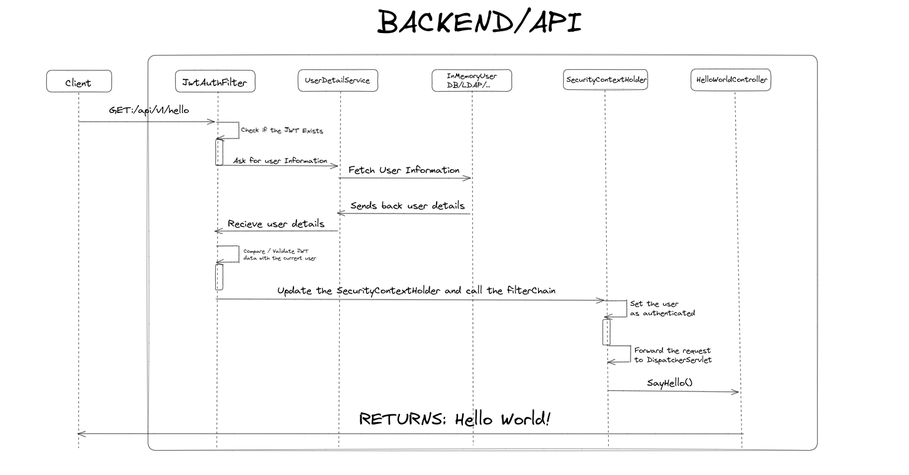
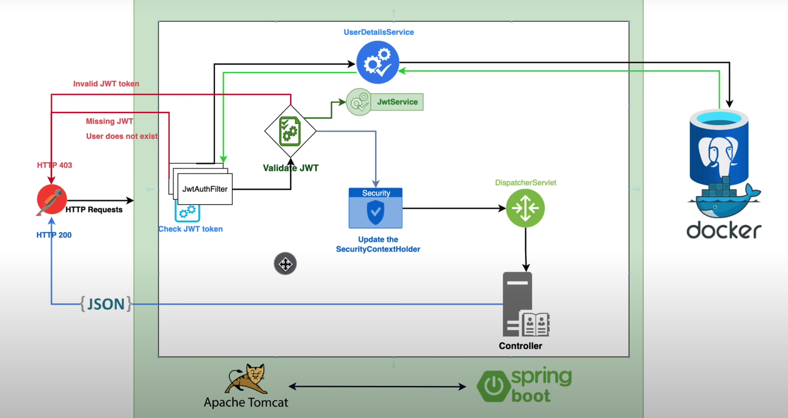

# Spring Security

## Check comments in code to see more details about it!

Creating a simple API

Basic Authentication and JSON Web Tokens !

    - For Spring Security dependency, it's always 'user' and the password which is generated by the dependency
    - http://localhost:8080/logout -> para deslogear
    

-> Java Class : config.SecurityConfig

    - @EnableWebSecurity
    - Now, look into "SpringBootWebSecurityConfiguration"
    - Let's copy to implement our own security filters

        @Bean
        public SecurityFilterChain securityFilterChain(HttpSecurity http) throws Exception {
            ((AuthorizeHttpRequestsConfigurer.AuthorizedUrl)http.authorizeHttpRequests().anyRequest()).authenticated();
            http.formLogin();
            http.httpBasic();
            return (SecurityFilterChain)http.build();
        }

    - We will build from the code above, our proper security filter for our API
    - Just trying in Postman with BasicAuthentication and auto-generated Password and User (user)

-> Now, let's move on JWT with JwtAuthFilter
- This is HOW JWT WORKS - DOWN BELOW:

    
    - We will implement all the classes there are show in the diagram above.
  
        1 - We need to add a new dependency to manage the JWT authentication
  
        2 - Set up a postgresql Database.

        3 - Let's declare a class for User (Model)
  
            - Look in the class to see the configuration of the class

        4 - Let's build a Role enum class for Roles
    
        5 - Let's build the Repository for the User class (UserRepository) and extends Jpa for methods like findById..

    - Now, CREATING A JWTAUTHENTICATIONHFILTER (IMPORTANT!)
    
    - Once implemented, let's move on with the "Check JWT Token" section of the diagram
        
    - New dependencies to manage the token auth.

        - ``		<dependency>
          <groupId>io.jsonwebtoken</groupId>
          <artifactId>jjwt-api</artifactId>
          <version>0.11.5</version>
          </dependency>
          <dependency>
          <groupId>io.jsonwebtoken</groupId>
          <artifactId>jjwt-impl</artifactId>
          <version>0.11.5</version>
          </dependency>
          <dependency>
          <groupId>io.jsonwebtoken</groupId>
          <artifactId>jjwt-jackson</artifactId>
          <version>0.11.5</version>
          </dependency>``

    - 
